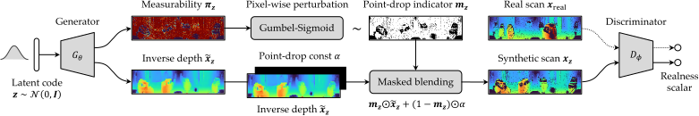
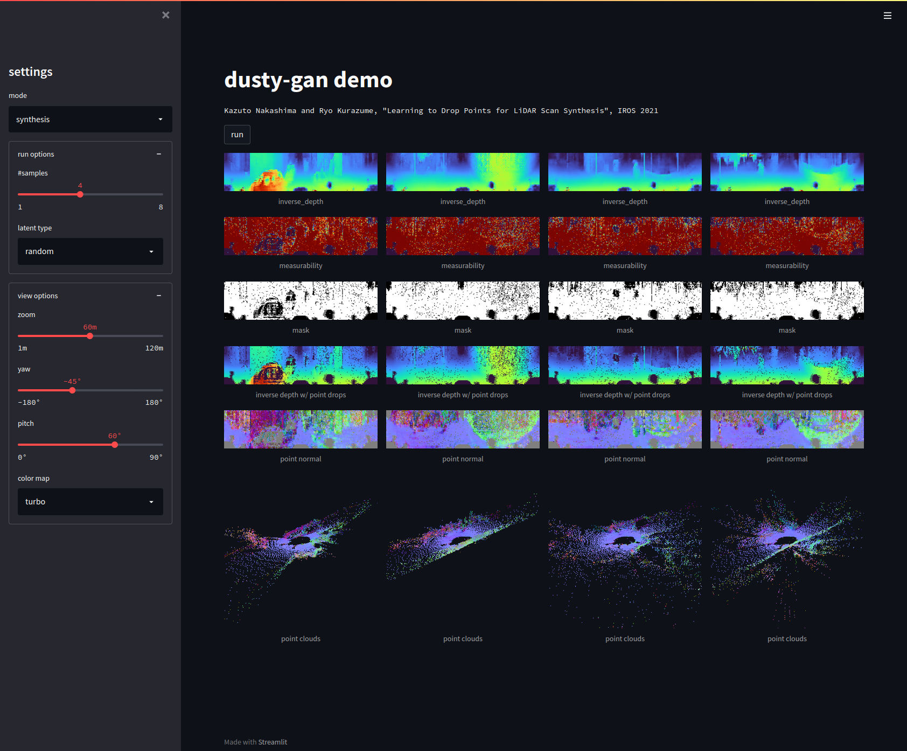
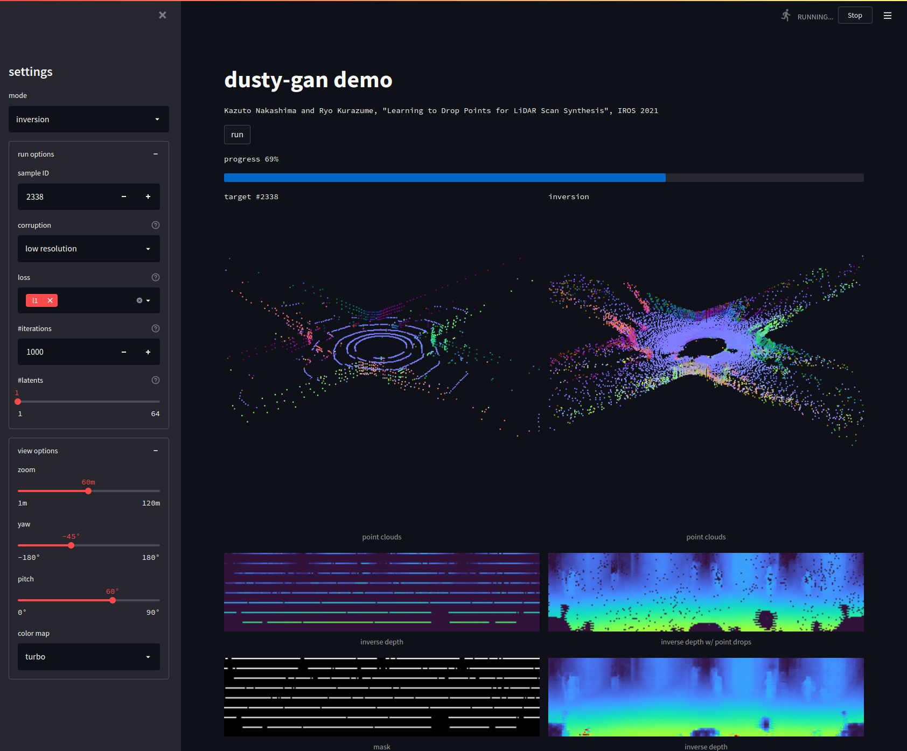

# Learning to Drop Points for LiDAR Scan Synthesis (IROS 2021)

This repository provides the official PyTorch implementation of the following paper:

**[Learning to Drop Points for LiDAR Scan Synthesis](https://arxiv.org/abs/2102.11952)**<br>
[Kazuto Nakashima](https://kazuto1011.github.io/) and [Ryo Kurazume](https://robotics.ait.kyushu-u.ac.jp/kurazume/en/)<br>
In IROS 2021<br>

**Overview:** 3D LiDARs often involve missing points due to the laser's reflectivity, which emerge as dropout noises on projected 2D space (aka spherical map). In this work, we propose DUSty, a noise-aware GAN that models 3D LiDAR data by learning the underlying <u>d</u>epth and reflective <u>u</u>ncertainty as 2D <u>sty</u>le codes.



**Generation:** The learned depth map (left), the measurability map for simulating the point-drops (center), and the final depth map (right).


**Reconstruction:** The trained generator can be used as a scene prior to restore LiDAR data.


## Requirements

To setup with anaconda:

```sh
$ conda env create -f environment.yaml
$ conda activate dusty-gan
```

## Datasets

Please follow [the instruction for KITTI Odometry](datasets/README.md). This step produces the azimuth/elevation coordinates (`angles.pt`) aligned with the image grid, which are required for all the following steps.

## Pretrained Models

|    Dataset     |      LiDAR       |  Method  |                         Weight                          |                      Configuration                      |
| :------------: | :--------------: | :------: | :-----------------------------------------------------: | :-----------------------------------------------------: |
| KITTI Odometry | Velodyne HDL-64E | Baseline | [URL](https://github.com/kazuto1011/dusty-gan/releases) | [URL](https://github.com/kazuto1011/dusty-gan/releases) |
|                |                  | DUSty-I  | [URL](https://github.com/kazuto1011/dusty-gan/releases) | [URL](https://github.com/kazuto1011/dusty-gan/releases) |
|                |                  | DUSty-II | [URL](https://github.com/kazuto1011/dusty-gan/releases) | [URL](https://github.com/kazuto1011/dusty-gan/releases) |

## Training

Please use `train.py` with `dataset=`, `solver=`, and `model=` options.
The default configurations are defined under `configs/` and can be overridden via a console ([reference](https://hydra.cc/docs/advanced/override_grammar/basic)).

```sh
$ python train.py dataset=kitti_odometry solver=nsgan_eqlr model=dcgan_eqlr # baseline
$ python train.py dataset=kitti_odometry solver=nsgan_eqlr model=dusty1_dcgan_eqlr # DUSty-I (ours)
$ python train.py dataset=kitti_odometry solver=nsgan_eqlr model=dusty2_dcgan_eqlr # DUSty-II (ours)
```

Each run creates a unique directory with saved weights and log file.

```sh
outputs/logs
└── dataset=<DATASET>
    └── model=<MODEL>
        └── solver=<SOLVER>
            └── <DATE>
                └── <TIME>
                    ├── .hydra
                    │   └── config.yaml # all configuration parameters
                    ├── models
                    │   ├── ...
                    │   └── checkpoint_0025000000.pth # trained weights
                    └── runs
                        └── <TENSORBOARD FILES> # logged losses, scores, and images
```

To monitor losses, scores, and images, run the following command to launch TensorBoard.

```sh
$ tensorboard --logdir outputs/logs
```

## Evaluation

To evaluate synthesis performance, run:

```sh
$ python evaluate_synthesis.py --model-path $MODEL_PATH --config-path $CONFIG_PATH
```

`MODEL_PATH` and `CONFIG_PATH` are `.pth` file and the corresponding `.hydra/config.yaml` file, respectively.
A relative tolerance to detect the point-drop can be changed via `--tol` option (default `0`).

To evaluate reconstruction performance, run:

```sh
$ python evaluate_reconstruction.py --model-path $MODEL_PATH --config-path $CONFIG_PATH
```

To optimize the relative tolerance for the baseline in our paper, run:

```sh
$ python tune_tolerance.py --model-path $MODEL_PATH --config-path $CONFIG_PATH
```

We used `0.008` for KITTI.

## Demo

```sh
$ streamlit run demo.py $MODEL_PATH $CONFIG_PATH
```

|               Synthesis                |             Reconstruction             |
| :------------------------------------: | :------------------------------------: |
|  |  |

## Citation

If you find this code helpful, please cite our paper:

```bibtex
@inproceedings{nakashima2021learning,
    title     = {Learning to Drop Points for LiDAR Scan Synthesis},
    author    = {Nakashima, Kazuto and Kurazume, Ryo},
    booktitle = {IEEE/RSJ International Conference on Intelligent Robots and Systems (IROS)},
    pages     = {222--229},
    year      = 2021
}
```