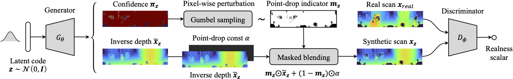
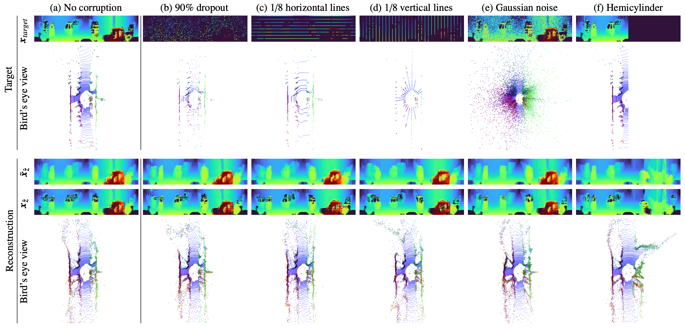

# Learning to Drop Points for LiDAR Scan Synthesis



**Learning to Drop Points for LiDAR Scan Synthesis**<br>
Kazuto Nakashima, Ryo Kurazume<br>
https://arxiv.org/abs/2102.11952

**Overview:** The goal of this study is to build a generative model of 3D LiDAR data (Velodyne-style radiated point clouds).
The LiDAR data can be processed as bijective 2D maps but susceptible to scattered binary noises in practice.
The binary noises are caused by failing laser reflection from measured objects.
To circumvent this issue, we propose a noise-aware GAN framework to synthesize LiDAR scan data.
Our generator is designed to produce an inverse depth map and simultaneously simulate point drops as multiplicative Bernoulli noises.
To sample the discrete noises, we employ a pixel-wise reparameterization with straight-through Gumbel-Sigmoid distribution.
Our approach enables to learn an underlying smooth depth manifold.
In our paper, we demonstrate the effectiveness in synthesis and reconstruction tasks on two LiDAR datasets.
We further showcase potential applications by recovering various corruptions in LiDAR data.

**Generation by interpolating learned latent codes:**<br>
The top two rows are from our generator and the third row is a final inverse depth map processed with a point-drop mask.


**Corruption recovery by optimizing a latent code:**


**Training/evaluation scripts will also be added soon**

<!-- ## Requirements

```sh
$ conda env create -f environment.yaml
$ conda activate dusty-gan
```

## Datasets

### KITTI Odometry set

Velodyne HDL-64E

### MPO Sparse set

Velodyne HDL-32E

## Training

```sh
$ python train.py
```

## Evaluation

### Synthesis

```sh
$ python test.py
```

### Reconstruction

```sh
$ python test.py
``` -->

## Citation

If you find this code helpful, please cite our paper:

```bibtex
@article{nakashima2021learning,
    title   = {Learning to Drop Points for LiDAR Scan Synthesis},
    author  = {Nakashima, Kazuto and Kurazume, Ryo},
    journal = {arXiv preprint arXiv:2102.11952},
    year    = 2021
}
```