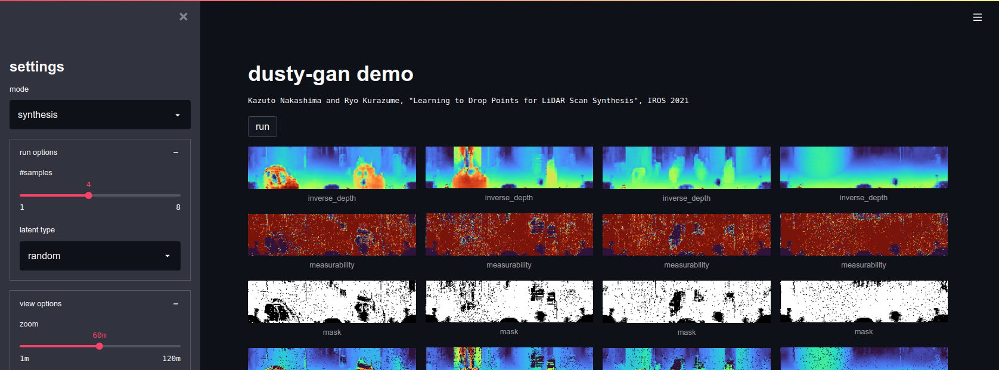

# Learning to Drop Points for LiDAR Scan Synthesis

*From left to right: a learned depth map, a measurabitlity map for sampling pixels, and a sampled depth map*


**Learning to Drop Points for LiDAR Scan Synthesis**<br>
[Kazuto Nakashima](https://kazuto1011.github.io/) and Ryo Kurazume<br>
In IROS 2021<br>
[[arXiv]](https://arxiv.org/abs/2102.11952)

**Overview:** We propose a noise-aware GAN for 3D LiDAR data, which learns inverse depth and measurement uncertainty on 2D representation from a collection of real LiDAR data involving dropout noises.


**Reconstruction:** A trained generator can be used as a scene prior to restore LiDAR data.


## Requirements

To setup with anaconda:

```sh
$ conda env create -f environment.yaml
$ conda activate dusty-gan
```

## Datasets

[Instruction for KITTI Odometry](datasets/README.md)

## Training

Please use `train.py` with `dataset=`, `solver=`, and `model=` options.
The default configurations are defined under `configs/` and can be overridden via a console ([reference](https://hydra.cc/docs/advanced/override_grammar/basic)).

```sh
$ python train.py dataset=kitti_odometry solver=nsgan_eqlr model=dcgan_eqlr # baseline
$ python train.py dataset=kitti_odometry solver=nsgan_eqlr model=dusty1_dcgan_eqlr # DUSty-I (ours)
$ python train.py dataset=kitti_odometry solver=nsgan_eqlr model=dusty2_dcgan_eqlr # DUSty-II (ours)
```

Each run creates a unique directory with saved weights and log file.

```sh
outputs/logs
└── dataset=<DATASET>
    └── model=<MODEL>
        └── solver=<SOLVER>
            └── <DATE>
                └── <TIME>
                    ├── .hydra
                    │   └── config.yaml # all configuration parameters
                    ├── models
                    │   ├── ...
                    │   └── checkpoint_0025000000.pth # trained weights
                    └── runs
                        └── <TENSORBOARD FILES> # logged losses, scores, and images
```

To monitor losses, scores and images, run the following command to launch TensorBoard.

```sh
$ tensorboard --logdir outputs/logs
```

## Evaluation

To evaluate synthesis performance, run:

```sh
$ python evaluate_synthesis.py --model-path $MODEL_PATH --config-path $CONFIG_PATH
```

`MODEL_PATH` and `CONFIG_PATH` are `.pth` file and the corresponding `.hydra/config.yaml` file, respectively.
A relative tolerance to detect the point-drop can be changed via `--tol` option (default `0`).

To evaluate reconstruction performance, run:

```sh
$ python evaluate_reconstruction.py --model-path $MODEL_PATH --config-path $CONFIG_PATH
```

To optimize the relative tolerance for the baseline in our paper, run:

```sh
$ python tune_tolerance.py --model-path $MODEL_PATH --config-path $CONFIG_PATH
```

We used `0.008` for KITTI.

## Demo

```sh
$ streamlit run demo.py $MODEL_PATH $CONFIG_PATH
```


## Citation

If you find this code helpful, please cite our paper:

```bibtex
@article{nakashima2021learning,
    title   = {Learning to Drop Points for LiDAR Scan Synthesis},
    author  = {Nakashima, Kazuto and Kurazume, Ryo},
    journal = {arXiv preprint arXiv:2102.11952},
    year    = 2021
}
```